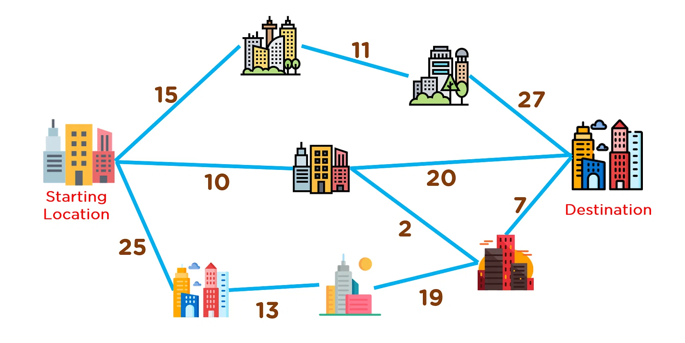

# Greedy, Array

- 발표 목차
  - Greedy에 대해 소개
  - 문제 소개 및 풀이

---

# Greedy 소개

- 탐욕 알고리즘

  problem-solving heuristic의 일종

  큰그림을 배제, 각 단계에서 최선의 선택

---

# Greedy 소개 -> Heuristic

<div style="display: flex; align-items: center; justify-content: center;">
    
    <div>
        <p>내삽</p>
        <p>직관적이고, 근사적인 해답</p>
    </div>
</div>

---

# Greedy 소개 -> Heuristic -> Greedy

### 각 단계에서 최적의 선택을 한다.



---

# 문제 소개

문제: 함수 만들기

    입력값: (flowerbed 배열, n 정수)

    출력값: boolean

---

# 문제 비틀기

주어진 flowerbed에 n개의 꽃을 추가로 심을 수 있을까?

-> flowerbed에 몇개의 꽃을 추가로 심을 수 있을까?

---

# 첫번째 풀이

1. theoricalMaximum = 추가로 심을수 있는 꽃의 이론상 최댓값을 구한다.
2. return theoricalMaximum >= n

---

# 아이디어: 연속된 zero의 개수를 세자.


```
let additionalFlower = 0; // 심을수 있는 꽃의 수
let numZero = 0; // 연속적으로 0이 나오는 수
```

---

# 반복문 로직

```
 for (const i of flowerbed ) {
        if(i == 0) {
            numZero += 1;
        } else if (numZero > 2) {
            additionalFlowers += Math.floor((numZero  -1)/ 2);
            numZero = 0;
        } else {
            numZero = 0;
            }
        }
additionalFlowers += Math.floor((numZero  -1)/ 2);

return additionalFlowers >= n
```

---

# 그런데 잠깐, 예외 처리 해주자.

모서리보정
-> 0이 2개만 있어도 꽃을 심을 수 있다.

<div style="display: flex; width:100%; height:50%; justify-content: space-evenly">
 

</div>

```
// 배열의 양끝에 0을 첨부한다.

flowerbed.unshift(0);
flowerbed.push(0);
```

---

# 코드의 문제점

- 언제나 이론적 최댓값을 구한다.
  -> greedy가 아니라 일반적인 값을 구한다.

# 추가코드 : 상계를 활용하자.

There are no two adjacent flowers in flowerbed.

꽃은 인접해서 심어질 수 없다.


```

// 화단의 길이 => 꽃의 상계가 정해진다.

(flowerbed.length /2) + 1

```

---

# 추가 코드 1. n < 상계

```

const theoricalMaximum = (flowerbed.length /2) + 1;

if (theoricalMaximum =< n) {
return false
}

```

- n이 상계를 초과시 함수를 바로 종료

---

# 추가 코드 2. - 심어진 꽃의 수 + n < 상계

```

const sumArray = function ([first, ...remain]) {
if (first === undefined) return 0;
return first + sumArray(remain);
}

if (theoricalMaximum =< sumArray(flowerbed) + n) {
return false
};

```

- 배열의 성분 총합 + n 이 상계를 초과시 함수를 바로 종료

---

# 코드 변경. - 이론상 최댓값을 구하지 않는다.

```
let numFlowers = n;
let numZero = 0;

/** 중략*/

for (const i of flowerbed ) {
    if(i == 0) {
         numZero += 1;
    }
    else if (numZero > 2) {
    numFlowers -= Math.floor((numZero  -1)/ 2);

    // 바로 탈출!

    if (numFlowers < 1) {
            return true
            }

    numZero = 0;

    } else {
        numZero = 0;
    }
        }

    numFlowers -= Math.floor((numZero  -1)/ 2);

    if (numFlowers < 1) {
    return true
    }

    return false
---
```
