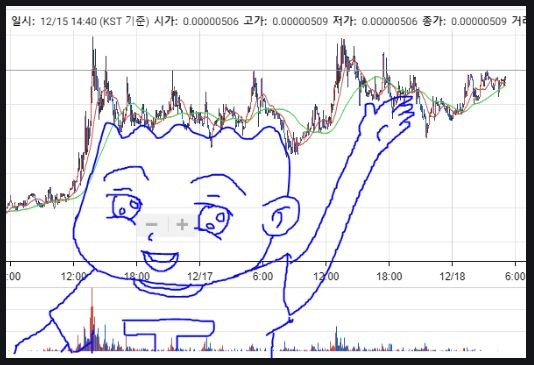
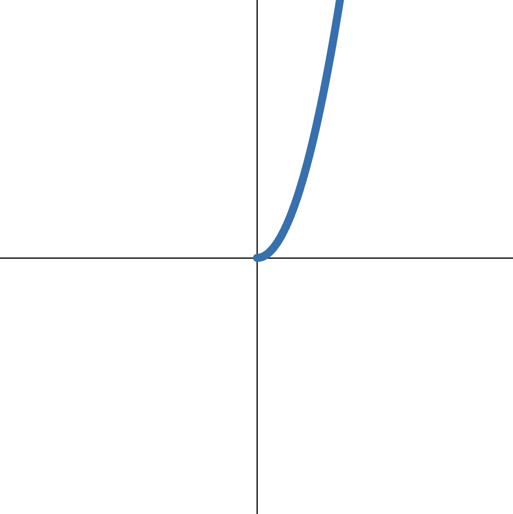
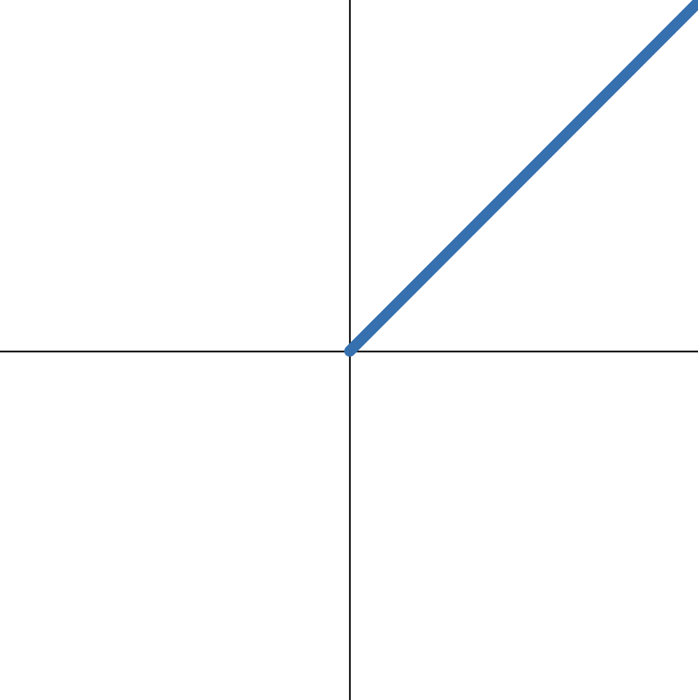
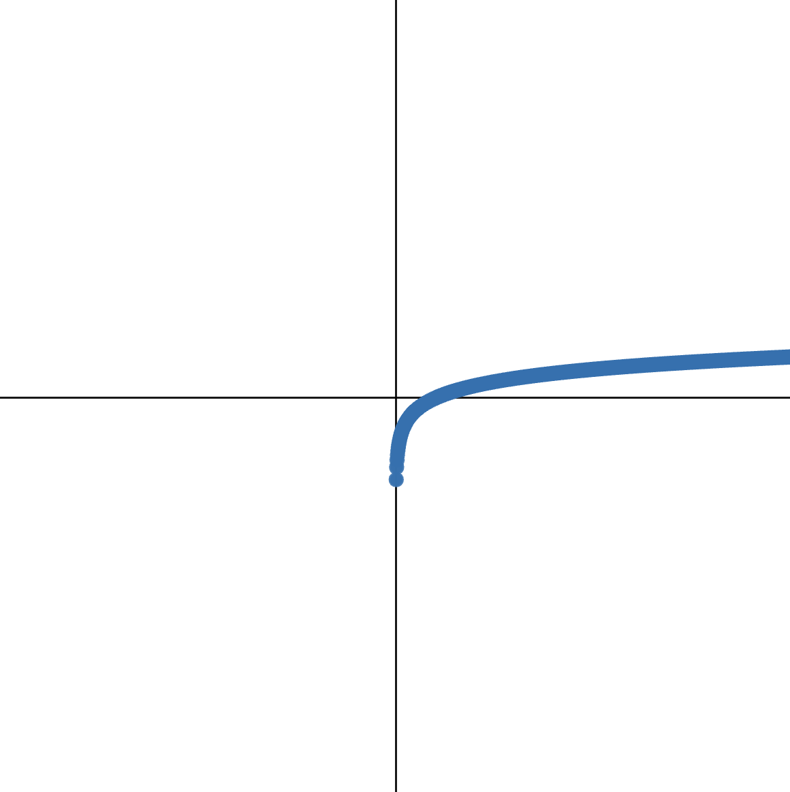
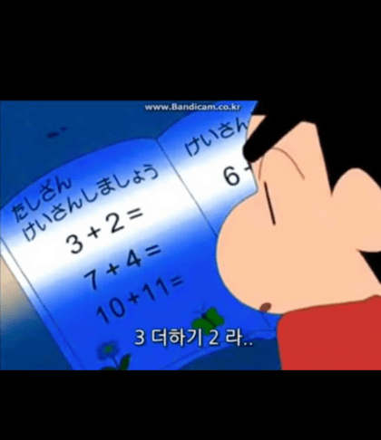
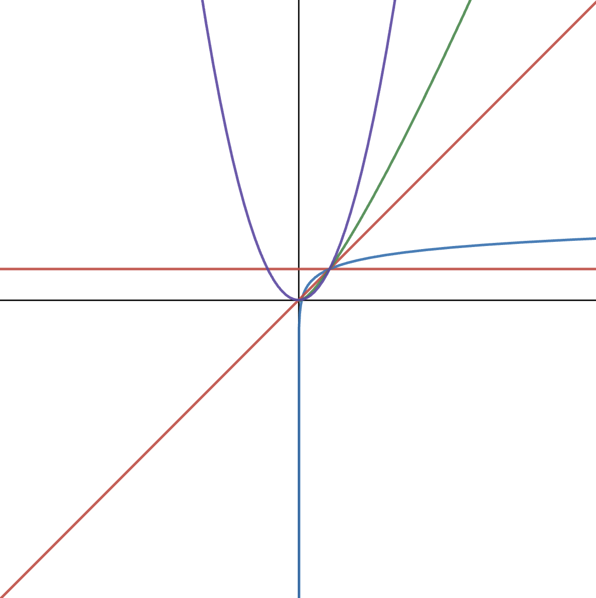

# 알고리즘에서 사용하는  빅오 표기법 Big O Notation

2023, sky(skysurfr)

---

~~내가 아는 빅오는 이건데...~~


---

## 빅오 표기법의 필요성

같은 목적으로 코딩한 여러가지 방법의 프로그래밍 코드 어느것이 베스트인가

~~변수 몇개, 글자 몇개가 다른게 아니라~~ 문제 접근 방식에 대한 것

---

### 우리는 언제 사용할까

> 면접관 : 이 코드(알고리즘)의 빅오 표기법은 무엇인가요?
>
> 나 : ....

~~이거 하러 배우고 있지만...~~

---

### ??? : 잠깐만요. 잘 돌아가기만 하면 좋은거 아닌가요?

&rarr; 대형 시스템에서의 많은 데이터를 처리할때는 사소한 차이가 큰 영향을 줄 수 있다
&rarr; 그러나, 한 해결책이 뛰어나게 좋은 경우는 거의 드물다
&rarr; 각각의 해결책이 다른 장단점이 있을 수 있다 (처리속도, 성능의 일관성, 버그 등)

예를 들어봅시다.

---

#### 영화의 년도와 평점을 동시에 만족하는 필터링 코드의 일부

```/* JavaScript */
function filterMovie(yearInfo, rateInfo) {
  let filteringMovies = [];
  for(let i = 0; i < yearInfo.length; i++) {
    let yearItem = yearInfo[i];
    for(let j = 0; j < rateInfo.length; j++) {
      let rateItem = rateInfo[j];
      if (yearItem.id === rateItem.id) {
        filteringMovies.push(rateItem);
      }
    }
  }
  return filteringMovies;
}

```

결론 : 뱅뱅 도는 거 같지만, 잘돌아갑니다.

---

#### 리팩토링 코드

```/* JavaScript */
function filterMovie(yearInfo, rateInfo) {
  let rateMap = new Map();

  for(let rateItem of rateInfo) {
    rateMap.set(rateItem.id, rateItem);
  }

  let filteringMovies = yearInfo
    .filter(yearItem => rateMap.has(yearItem.id))
    .map(yearItem => rateMap.get(yearItem.id));

  return filteringMovies;
}
```

결론 : 잘돌아갑니다. 뭔가 더 똑똑해 보이지 않나요?

---

### 두 코드의 차이점을 비교할 수 있는 객관적 기준이 필요하다

코드를 더 잘 이해하고, 더 좋은 코드를 쓰기 위해서...

빅오 표기법은 어디서 문제가 나타나는지 찾아낼 가능성을 높인다

---

### 기준이 될만한 것 (1)

- **속도** : 가장 확실하고 직관적이지만 측정할 때마다 다르다
- **성능 점유율** : 속도와 크게 다르지 않음
- 코드의 길이(혹은 깔끔하게 정리되었는가) : 짧다고 읽기 좋은거 아니고, 정리되었다고 잘 돌아간다는 보장 없다

&rarr; 3가지가 잘 조화되면 더 좋겠죠 (모든 걸 만족하는 건 없지 않을까)

---

### 기준이 될만한 것 (2) : 연산 횟수를 세는 것

- 컴퓨터 성능에 구애받지 않는다
- 실제 연산은 정확하게 샐 수 있기 때문에 코드끼리 비교가 가능하다
- 연산이 늘어나면 보통 시간도 비례로 증가한다
- 입력 크기를 $x$축이라고 했을때 시간(연산횟수)를 $y$축으로 본다

---

#### 이 코드의 *정확한* 연산 횟수는?

```/* JavaScript */
function filterMovie(yearInfo, rateInfo) {
  let filteringMovies = [];
  for(let i = 0; i < yearInfo.length; i++) {
    let yearItem = yearInfo[i];
    for(let j = 0; j < rateInfo.length; j++) {
      let rateItem = rateInfo[j];
      if (yearItem.id === rateItem.id) {
        filteringMovies.push(rateItem);
      }
    }
  }
  return filteringMovies;
}
```

변수 한번 선언, ```for```문 한번, 그 안에 변수 또 선언, 그리고 ```for```문이 중첩, 그 안에서 변수 선언, ```if```문 처리하고, 메서드 동작하고...

---

#### 리팩토링 코드의 *정확한* 연산 횟수는?

```/* JavaScript */
function filterMovie(yearInfo, rateInfo) {
  let rateMap = new Map();

  for(let rateItem of rateInfo) {
    rateMap.set(rateItem.id, rateItem);
  }

  let filteringMovies = yearInfo
    .filter(yearItem => rateMap.has(yearItem.id))
    .map(yearItem => rateMap.get(yearItem.id));

  return filteringMovies;
}
```

변수 한번 선언, ```for```문 돌고, 그 안에 메서드, 그 다음에 변수 선언해서 대입하는데 메서드가 두번 도는데 그 안에 콜백 있고...

---

### 전체적인 큰 그림이 중요하다 ~~(&rarr; 이거 말고)~~

일일히 세는 것은 빅오 표기법을 사용하는 목적이 아니다

주식에서 가격보다는 추세를 봐야 하는 것과 마찬가지로
(예: 삼성전자 얼마나 올랐어?)



---

#### 이 코드의 *대략적인* 연산 횟수는?

```/* JavaScript */
function filterMovie(yearInfo, rateInfo) {
  let filteringMovies = [];
  for(let i = 0; i < yearInfo.length; i++) {
    let yearItem = yearInfo[i];
    for(let j = 0; j < rateInfo.length; j++) {
      let rateItem = rateInfo[j];
      if (yearItem.id === rateItem.id) {
        filteringMovies.push(rateItem);
      }
    }
  }
  return filteringMovies;
}
```

각기 다른 인자를 $n$과 $m$이라고 할 때 for문이 두번 중첩되어 되니까 $n*m$ 번

---

##### 최대한 단순화 해서, 빅오 표기법으로 표현하면  :  $O( n^2 )$

~~주식 떡상~~
지수적으로, 이차(Quadratic) 시간으로 증가 (가로축 입력량, 세로축 연산 횟수)

- 버블 정렬 Bubble Sort
- 선택 정렬 Selection Sort
- 삽입 정렬 Insertion Sort



---

#### 리팩토링 코드의 *대략적인* 연산 횟수는?

```/* JavaScript */
function filterMovie(yearInfo, rateInfo) {
  let rateMap = new Map();

  for(let rateItem of rateInfo) {
    rateMap.set(rateItem.id, rateItem);
  }

  let filteringMovies = yearInfo
    .filter(yearItem => rateMap.has(yearItem.id))
    .map(yearItem => rateMap.get(yearItem.id));

  return filteringMovies;
}
```

```for```문으로 ```rateInfo```가 $n$번 돈다고 했을때,
```yearInfo```가 ```filter``` 메서드로 $n$번 돌고, ```map``` 메서드로도 $m$번 도니까 $n+2m$ 번

---

##### 최대한 단순화 해서, 빅오 표기법으로 표현하면 $O( n )$

선형적으로 증가(linear), 입력만큼 비례해서 시간도 늘어난다

- 배열 검색
- 리스트 순회



---

##### Big O : constant :  $O( 1 )$

입력이 늘어나도 항상 일정한 시간(상수)만 소비한다

- 배열의 n번째 선택
- 스택 Stack : Push/Pop
- 큐 Queue : 삽입 Insert / 삭제 Delete


---

### Big O 표기법

- 최대한 단순하게, 대략 알면 된다(Rules of Thumb)
- 숫자(상수)는 제외, 숫자 외 더 뺄것이 없으면 1
- $n$ 증가율을 반영할때도 가장 영향력이 큰 것 이외에는  가지치기 한다

예제:
> $50$ &rarr; $O(1)$
> $9n + n + 100$ &rarr; $O(n)$
> $2n^2 + 3m$ &rarr; $O(n^2)$
> $n^3 + 10m^2$ &rarr; $O(n^3)$

---

#### Big O에서 연산 횟수를 세는 방법 : **상수**

- $+$, $-$, $/$, %(나누기)
- 변수 선언
- 인덱스 Index 로 배열에 접근
- 오브젝트를 키로 접근

---

#### Big O에서 연산 횟수를 세는 방법 : **$n$ 이상**

- 루프 loop 안에 있으면 $n$
- 루프 안에 루프(중첩) 있으면 $n^2$
- 루프라고 해도 연산 횟수가 조건에 의해 항상 제한되면 $n$ 이 아니고 상수

---

#### 로그를 사용하는 경우 : $O(log n)$

로그 시간 $O$ : 입력이 증가할 수록 $n$을 반으로 나누면서 증가

$O(1) < O(log n) < O(n)$

- 이진 검색 Binary Search
- 효율적인 정렬 알고리즘
- 일부 재귀함수 Recursion 의 공간 복잡도 Space Complexity



---

#### 로그 Logarithms 란?

지수함수의 역함수 ~~수학이다~~



---

#### 로그를 사용하는 경우 : $O(n log n)$

$N$ 로그 $N$ 시간 $O$ : 실행 시간이 입력 크기와 로그의 곱에 비례

$O(n) < O(n log n) < O(n^2)$

- 병합 정렬 Merge Sort
- 퀵 정렬 Quick Sort
- 힙 정렬 Heap Sort


---

### Big O Graph

- <span style="color:red">$O(1)$</span>
- <span style="color:blue">$O(log n)$</span>
- <span style="color:red">$O(n)$</span>
- <span style="color:green">$O(n log n)$</span>
- <span style="color:darkviolet">$O(n^2)$</span>



---

<strong style="color:red">[REMIND!]</strong>
지금까지 배운 것 : **시간 복잡도 Time Complexity**


---

## 공간 복잡도 Space Complexity

알고리즘에서 공간이란
> 메모리 Memory 를 차지하는 크기

알고리즘에서 정의하는 공간의 범위: *보조 공간 복잡도 auxiliary space complexity*
>입력을 제외하고 알고리즘 자체가 필요로 하는 공간

---

### JavaScript에서 공간복잡도

- Boolean, Numbers, ```undefined```, ```null``` 은 상수 공간 Constant Space
- String은 $O(n)$ 공간 (글자 길이 $n$만큼)
- 참조 타입 Reference Type (배열, 오브젝트)은 $O(n)$

---

## Recap

- 입력의 크기가 늘어날수록 추세의 변화와 관련이 있다
- 빅오를 통해서 시간과 공간 복잡도를 잘 이해할 수 있다
- 정확도 보다는 전체적인 추세가 중요하다


---

## 그래서, 우리가 말할 수 있어야 하는 것은?

> "이 코드의 시간 복잡도는 $O(n^2)$ 이고 공간 복잡도는 $O(n)$ 입니다"

---

## 내용 참조

- 주요 참조 : [udemy 알고리즘 강의](https://www.udemy.com/course/best-javascript-data-structures/learn/lecture/28559365#overview) (유료), [ChatGPT](https://chat.openai.com/?model=gpt-4), [**노마드 코더 YouTube**](https://youtu.be/BEVnxbxBqi8)
- 기타 참조 :
[https://codesyun.tistory.com/104](https://codesyun.tistory.com/104)
[https://brunch.co.kr/@younggiseo/338](https://brunch.co.kr/@younggiseo/338)
- 그래프 이미지 캡처 : [Desmos | 그래핑 계산기](https://www.desmos.com/calculator)
- 기타 이미지 : 구글 이미지 검색

---

## 유용한 도구들 : 알고리즘 시각화

- [Performance Tracker](https://rithmschool.github.io/function-timer-demo/) : function을 입력하고 값을 넣어주면 추세를 그래프로 찍어준다 (udemy 강의에서 사용)
- [VISUALGO.NET](https://visualgo.net/en) : 데이터 구조 알고리즘을 애니메이션으로 시각화
- [Algorithm Visualizer](https://algorithm-visualizer.org/) : 각 알고리즘 기법에 대한 코드, 시각화 자료와 텍스트 로그 제공
